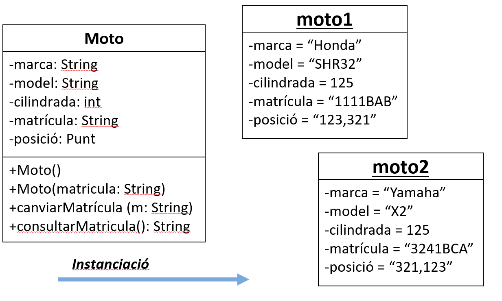
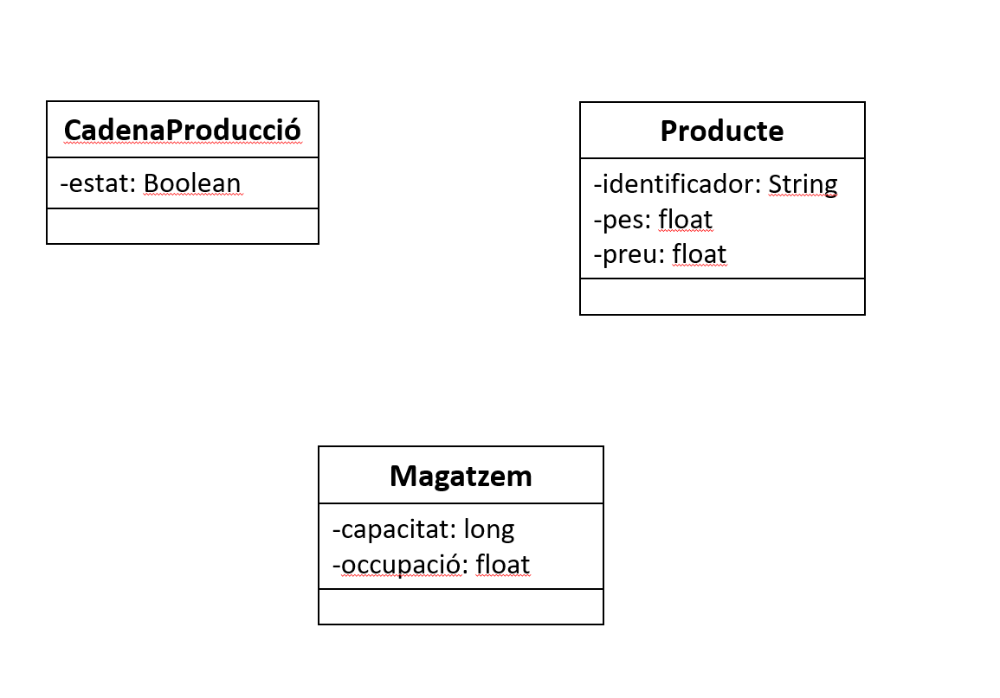
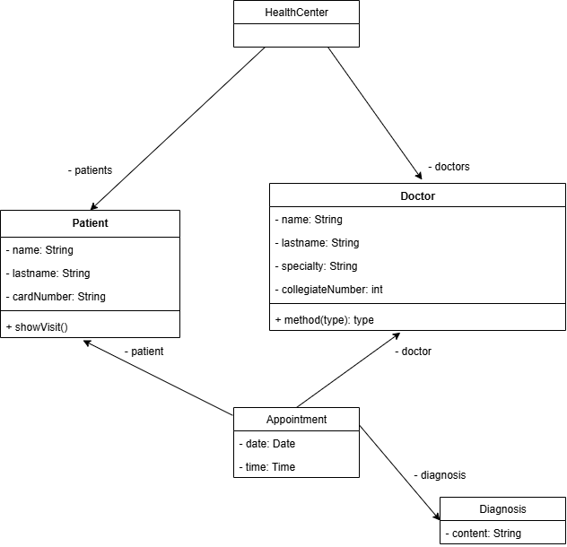

# POO-GES-2526

# Session 1

## Paradigmas de programación

- [x] Programación imperativa
- [x] Programación funcional
- [x] Programación lógica
- [x] Programación orientada a objetos

## Introducción a la Programación orientada a objetos

### Definición

La Programación Orientada a Objetos (POO) es un paradigma de programación que se basa en el concepto de "objetos". Estos objetos pueden contener datos, en forma de atributos (propiedades), y código, en forma de métodos (funciones). La POO se centra en la creación y manipulación de estos objetos para modelar y resolver problemas del mundo real.

### Ventajas de la POO

- Los objetos son más fáciles de entender
- Los especialistas pueden comunicarse mejor
- Los datos y los procesos relacionados están agrupados
- Mayor capacidad de reutilización
- Es una metodología de programación probada y madura

### Conceptos básicos

- [x] Clase
- [x] Objeto

### Clase

Una clase es una plantilla o un molde que define las características y comportamientos comunes de un conjunto de objetos. Es una estructura que agrupa datos y funciones relacionadas.

### Objeto

Un objeto es una instancia de una clase. Es una entidad que combina datos y comportamiento. Los objetos tienen atributos (propiedades) y métodos (funciones) que definen su estado y comportamiento.

### Ejemplo



```java
class Moto{
    // Atributos
    String color;
    String marca;
    int velocidad;

    // Métodos
    void acelerar(int incremento){
        velocidad += incremento;
    }

    void frenar(int decremento){
        velocidad -= decremento;
    }
    void mostrarVelocidad(){
        System.out.println("Velocidad actual: " + velocidad + " km/h");
    }
```

```java
class Main {
    public static void main(String[] args) {
        // Crear un objeto de la clase Moto
        Moto miMoto = new Moto();

        // Asignar valores a los atributos
        miMoto.color = "Rojo";
        miMoto.marca = "Yamaha";
        miMoto.velocidad = 0;

        // Usar los métodos del objeto
        miMoto.acelerar(50);
        miMoto.mostrarVelocidad(); // Velocidad actual: 50 km/h

        miMoto.frenar(20);
        miMoto.mostrarVelocidad(); // Velocidad actual: 30 km/h
    }
}
```

### Detectar clases y atributos

Las áreas de tipo producción gestionan una o varias cadenas de producción. Una cadena de producción sólo puede estar gestionada por una única área de producción. Las cadenas de producción presentan un estado, en funcionamiento o paro, producen productos y abastecen los almacenes. Un producto tiene un identificador numérico, un peso y un precio. Un almacén es gestionado por una única área comercial, mientras que un área comercial puede gestionar uno o varios almacenes al mismo tiempo. Un almacén está caracterizado por una capacidad y un porcentaje de ocupación.



### Code examples

- [Hospital](./session%2001/example%20Hospital)

# Session 2

## UML (Unified Modeling Language)

**UML** es un lenguaje de modelado estandarizado que permite representar de manera gráfica la estructura y el comportamiento de un sistema de software.  
No es un lenguaje de programación, sino una herramienta para **diseñar, visualizar y comunicar** cómo se organiza y funciona una aplicación antes (o durante) su implementación.

[ver documento](./assets/POO-UML-DiagramaClasses.pdf)

### Diagrama de Clases

En el contexto de la **programación orientada a objetos**, el diagrama más utilizado es el **diagrama de clases**, que describe:

- **Clases**: representadas como rectángulos divididos en:
  - Nombre  
  - Atributos  
  - Métodos  

- **Visibilidad**:  
  - [x] `+` público  
  - [x] `-` privado  
  - [ ] `#` protegido  
  - [ ] `~` package (visible solo dentro del mismo paquete)  

- **Relaciones**:
  - [x] **Asociación**: conexión entre clases (ej. *Paciente – Médico*).  
  - [x] **Agregación**: relación débil de "todo-parte" (ej. *Hospital – Paciente*).  
  - [x] **Composición**: relación fuerte de "todo-parte", donde el ciclo de vida de la parte depende del todo (ej. *Historia clínica – Entrada médica*).  
  - [ ] **Herencia (Generalización)**: relación jerárquica (ej. *Usuario → Paciente / Médico*).  
  - [x] **Dependencia**: una clase usa a otra de forma temporal, sin necesidad de relación estructural (ej. *Médico → Receta*).  

### Beneficios de usar UML

- Facilita la **comunicación** entre desarrolladores, diseñadores y no técnicos.  
- Sirve como **documentación viva** del sistema.  
- Ayuda a **detectar errores de diseño** antes de programar.  
- Permite una **visión global** de la arquitectura del software.  

### Code examples

- [Point](./session%2002/example%20Point)
- [Company](./session%2002/example%20Company)
- [Moto](./session%2002/example%20Moto)

### Ejercicios

#### Ejercicio 01
**A partir de este texto:**

En un centro de salud, los pacientes piden citas con los médicos. De cada paciente interesa guardar su nombre, apellido y número de tarjeta sanitaria. De cada médico interesa registrar su nombre, especialidad y número de colegiado. Cada cita tiene una fecha y hora, y está asociada a un paciente y a un médico. Los médicos pueden diagnosticar a los pacientes durante la cita. Los pacientes pueden consultar el resumen de su cita, donde aparezca: el nombre del médico, su especialidad y la fecha de la cita.

**Detecta clases, relaciones, crea el diagrama de clases en UML y codifícalo en Java.**


[documento drawio](./assets/healthCenter.drawio)
[java code](./session%2003/health-center/)

#### Ejercicio 02

**A partir de este texto:**

En la región de Kantalunya, los entrenadores registran a sus Pokémon en el Centro Pokémon.
Cada entrenador tiene una identidad propia y un nivel de experiencia que refleja cuánto ha progresado en sus viajes. Además, cada uno puede llevar consigo un equipo de hasta seis Pokémon, que puede organizar libremente (añadiendo o retirando miembros).

Los Pokémon que forman parte de un equipo se diferencian por su especie y, en ocasiones, por un apodo que les asigna el entrenador. Su fuerza varía según el nivel que alcanzan y su estado de salud se representa en puntos de vida. Para que puedan ser identificados fácilmente en el sistema, cada Pokémon cuenta con un código único en la Pokédex.

Durante los combates, cada Pokémon puede atacar a un oponente o defenderse en su turno. Además, cada Pokémon pertenece a un tipo principal (como Agua, Fuego, Planta o Eléctrico) y, en algunos casos, puede contar con un segundo tipo que complementa al primero. En este ejercicio, los tipos se representarán como cadenas de texto.

**Detecta clases, relaciones, crea el diagrama de clases en UML y codifícalo en Java.**