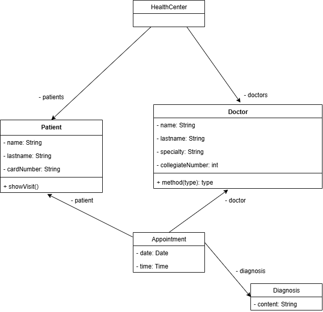

# Modelado UML y Proyecto `health-center`

En esta sesión se practicó el proceso de pasar de una idea informal a un **modelo UML sencillo** y luego a una **implementación en Java** (proyecto `health-center`). Se utilizó un diagrama (`healthCenter.drawio` / `healthcenter.drawio.png`) para razonar sobre clases, atributos y relaciones antes de codificar.

## Objetivo del dominio

Modelar citas médicas en un pequeño centro de salud: un paciente reserva una cita con un doctor y de esa cita surge (opcionalmente) un diagnóstico.

## Clases implementadas

| Clase         | Responsabilidad principal                               | Atributos clave                                     |
| ------------- | ------------------------------------------------------- | --------------------------------------------------- |
| `Doctor`      | Representa a un médico y su información profesional     | `name`, `lastName`, `specialty`, `collegiateNumber` |
| `Patient`     | Representa a un paciente del centro                     | `name`, `lastName`, `cardNumber`                    |
| `Diagnosis`   | Contiene el texto del diagnóstico resultante de la cita | `content`                                           |
| `Appointment` | Agrega la información de una cita concreta              | `date`, `doctor`, `patient`, `diagnosis`            |

## Relaciones (vista conceptual)

- Un **Doctor** puede estar asociado a muchas `Appointment` (1..\*)
- Un **Patient** puede tener muchas `Appointment` (1..\*)
- Cada **Appointment** referencia exactamente **un Doctor** y **un Patient** (1..1 en cada extremo desde la perspectiva de la cita)
- Una **Appointment** tiene **un Diagnosis** (en el código siempre se asigna, pero conceptualmente podría ser opcional si la lógica creciera)

## Diagrama de clases

## Métodos destacados

- `Doctor.getFullName()` y `Patient.getFullName()` encapsulan la composición de nombre completo.
- `Appointment.ShowInfo()` imprime un resumen legible de la cita (doctor, especialidad, paciente, fecha).

## Flujo básico (ejemplo en `Main`)

1. Crear instancias de `Doctor` y `Patient` llenando sus atributos vía setters.
2. Crear un `Diagnosis` y asignar el texto.
3. Crear un `Appointment` y enlazar: fecha (`Date`), doctor, paciente y diagnóstico.
4. Invocar `ShowInfo()` para mostrar los datos.
5. Repetir para más citas reutilizando el mismo paciente con otro doctor (demostrando multiplicidad).
