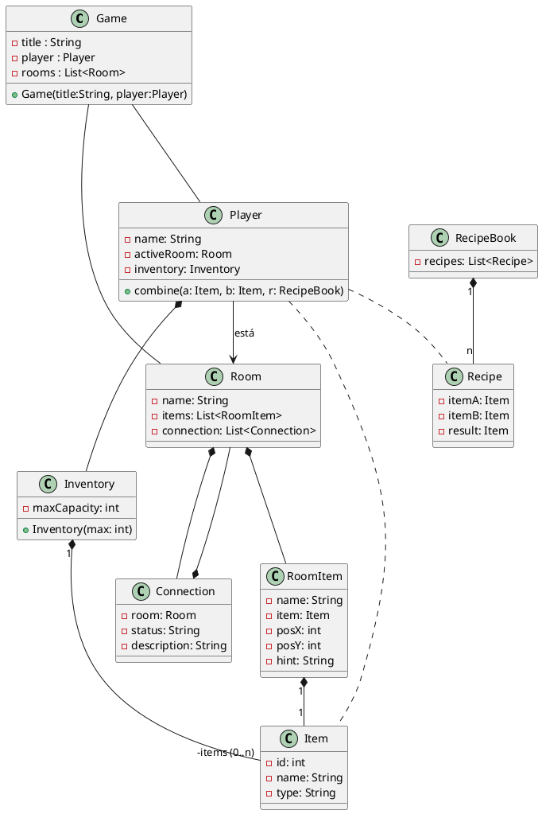

## hello

```plantuml
@startuml
class Game {
- title : String
- player : Player
- rooms : List<Room>
+ Game(title:String, player:Player)
}

class Inventory{
- maxCapacity: int
+ Inventory(max: int)
}

class Connection{
- room: Room
- status: String
- description: String
}

class Item {
- id: int
- name: String
- type: String
}

class Player{
- name: String
- activeRoom: Room
- inventory: Inventory
+ combine(a: Item, b: Item, r: RecipeBook)
}

class Recipe{
- itemA: Item
- itemB: Item
- result: Item
}

class RecipeBook {
- recipes: List<Recipe>
}

class Room {
- name: String
- items: List<RoomItem>
- connection: List<Connection>
}

class RoomItem{
- name: String
- item: Item
- posX: int
- posY: int
- hint: String
}

Game --- Player
Game --- Room

Inventory "1" *-- "-items (0..n)" Item
Room *-- RoomItem
RoomItem "1" *-- "1" Item
Player --> Room : está
RecipeBook "1" *-- "n" Recipe
Room *-- Connection
Connection *-- Room
Player *-- Inventory
Player .. Recipe
Player .. Item

@enduml
```