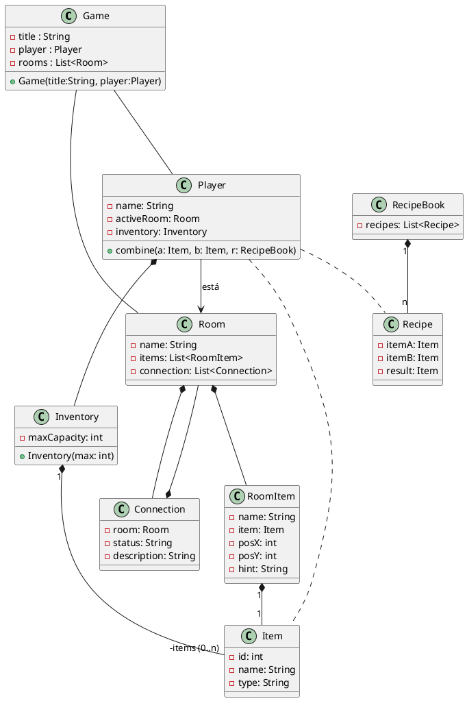

## The curse of laSalle island

En una vieja mansión victoriana, un jugador recorre distintas estancias en busca de una llave legendaria capaz de abrir la puerta principal, sellada desde hace siglos.  
Cada habitación oculta pistas, objetos y pasadizos secretos. Algunos ítems se pueden recoger, otros solo observar, y algunos pueden combinarse para crear herramientas nuevas.

El jugador dispone de un **inventario** donde guarda los objetos que va encontrando, y puede desplazarse por las **escenas** conectadas entre sí.  
Cada **escena** contiene varios ítems distribuidos en el espacio (sobre una mesa, dentro de un cofre, en una estantería…).  
El jugador puede interactuar con ellos: recogerlos, dejarlos o intentar combinarlos con otros.

Durante la partida, el jugador podrá moverse libremente entre las salas, siempre que exista una **conexión** entre ellas (por ejemplo, una puerta o un pasadizo).  
Algunos accesos podrían estar bloqueados, exigiendo resolver un enigma o fabricar un objeto determinado.

También existe un **recetario** (o libro de combinaciones) que define qué ítems pueden fusionarse para crear uno nuevo.

## Diagrama de clases

Copia este código en (https://editor.plantuml.com/)[https://editor.plantuml.com/] para ver el diagrama.

